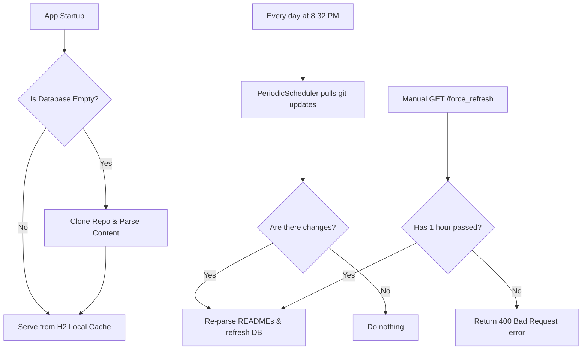

# GitHub Repository Reader 🚀

A beginner-friendly Spring Boot 3 backend application that automatically clones, parses, caches, and serves markdown tutorials from a GitHub repository ([JavaInREADME](https://github.com/abusaeed2433/JavaInREADME)) using a file-persistent H2 database.

---

## 📌 Features
- **Git Integration:** Automatically clones and pulls the latest content of a specified repository on startup or demand.
- **Markdown Parsing:** Recursively parses README markdown files, extracts directories, handles index ordering, and cleans up footer/navigation menus.
- **H2 Persistent Cache:** Saves parsed content locally to speed up API responses (`< 10ms` response times).
- **Daily Scheduler:** Runs a background cron job daily to pull and synchronize any updates from GitHub.
- **Interactive Swagger UI:** Offers a graphical interface to document and try out all API endpoints directly from the browser.
- **H2 Web Console:** Includes an in-browser database client to inspect tables and execute SQL queries.

---

## 📂 Project Directory Structure

```text
src/main/java/com/example/github_repo_reader/
├── config/                  # Configuration beans (CORS, WebClient, OpenAPI Swagger)
├── controller/              # REST Controller (API endpoints definition)
├── db/                      # Database Layer (Entities, PKs, Repositories, Services)
│   ├── blog/                # Blog markdown body content
│   ├── topic/               # Central topics (e.g. Data Type, Inheritance)
│   ├── sub_topic/           # Individual subtopics inside topics
│   ├── repo/                # Repository detail caching
│   ├── contribution/        # Repository contributors caching
│   └── last_fetched/        # Timestamps of last git synchronizations
├── index/                   # Topic structure definition mappings
├── repo_reader/             # Git commands runner (Cloning/Pulling scripts)
├── schedular/               # Spring Schedule cron job tasks
└── utility/                 # Utility parsers (traverses readme directories & cleans content)
```

---

## 🛠️ Getting Started (Step-by-Step)

### Prerequisites
- **Java JDK 21** or higher installed.
- **Maven** (included in the project via Maven wrapper `./mvnw` or `mvnw.cmd`).
- **Git** installed on your operating system.

---

### Step 1: Clone the Project
Open your terminal and clone this project:
```bash
git clone https://github.com/Raisenil/Ostad-Java-SpringBoot-3-Module-26-Assignment.git
cd "Github Repo reader"
```

---

### Step 2: Configure Github Access Token (Optional but Recommended)
To prevent hitting GitHub API rate limits, set your GitHub personal access token as an environment variable before starting the application:

**On Windows (Command Prompt):**
```cmd
set GITHUB_TOKEN=your_github_personal_token_here
```

**On Windows (PowerShell):**
```powershell
$env:GITHUB_TOKEN="your_github_personal_token_here"
```

**On Linux / macOS:**
```bash
export GITHUB_TOKEN="your_github_personal_token_here"
```

---

### Step 3: Run the Application
Start the application using the Maven wrapper:

**On Windows:**
```cmd
mvnw spring-boot:run
```

**On Linux / macOS:**
```bash
./mvnw spring-boot:run
```

Once started, the application will boot on **port 8082** and immediately start a background thread to clone and parse the repository if the database is currently empty.

---

## 🔌 API Endpoints Reference

### 👥 1. Get Repository Contributors
Returns a list of all contributors for the target repository from the local H2 cache database.
* **URL:** `/api/v1/read_contributions`
* **Method:** `GET`
* **Example Response:**
```json
{
  "data": [
    {
      "name": "JavaInREADME",
      "description": "This contains some basic java topics in a short and simple way.",
      "url": "https://github.com/abusaeed2433/JavaInREADME",
      "contribution": [
        {
          "user_name": "abusaeed2433",
          "contribution_count": 291,
          "profile_url": "https://avatars.githubusercontent.com/u/67331796?v=4"
        }
      ]
    }
  ],
  "message": "Read successful",
  "success": true
}
```

---

### 📖 2. Get Repository Indices
Returns a list of all parsed categories, topics, and subtopics in order.
* **URL:** `/api/v1/read_indices`
* **Method:** `GET`
* **Example Response:**
```json
{
  "data": [
    {
      "topic_name": "Data type",
      "no_of_sub_topics": 1,
      "subTopicList": [
        {
          "sub_topic_name": "Data type"
        }
      ]
    }
  ],
  "message": "Read successful",
  "success": true
}
```

---

### 📝 3. Get Blog Content
Fetches the detailed markdown body content for a specific topic and subtopic query.
* **URL:** `/api/v1/read_blog?topic_name={topic_name}&sub_topic_name={sub_topic_name}`
* **Method:** `GET`
* **Example Query:** `/api/v1/read_blog?topic_name=Data type&sub_topic_name=Data type`
* **Example Response:**
```json
{
  "data": {
    "topic_name": "Data type",
    "sub_topic_name": "Data type",
    "content": "#### Java is a statically typed programming language..."
  },
  "message": "Read successful",
  "success": true
}
```

---

### 🔄 4. Force Update Database
Manually triggers git pull updates, re-parses everything, and overrides the database cache. Rate-limited to **1 call per hour** to prevent server load.
* **URL:** `/api/v1/force_refresh`
* **Method:** `GET`
* **Example Response (Rate limit active):**
```json
{
  "data": null,
  "message": "Can be called after 58 minutes",
  "success": false
}
```

---

## 🧪 Interactive Testing (Swagger UI)
You can visually test every REST endpoint directly inside your browser:
1. Start the app.
2. Visit **[http://localhost:8082/swagger-ui.html](http://localhost:8082/swagger-ui.html)**.
3. Click on any endpoint, tap **"Try it out"**, fill in variables, and hit **"Execute"**.

---

## 🗄️ Inspecting the Database (H2 Console)
To see how the tables look and run raw SQL queries:
1. Visit **[http://localhost:8082/h2-console](http://localhost:8082/h2-console)** in your browser.
2. Set the JDBC URL to:
   ```text
   jdbc:h2:file:./data/github_repo_reader
   ```
3. Set Username to `sa` and leave the Password **blank**.
4. Click **"Connect"**. You can now inspect all 6 tables: `TOPIC`, `SUB_TOPIC`, `BLOG`, `MY_REPO`, `CONTRIBUTION`, and `LAST_FETCHED`.

---

## ⚙️ How Synchronization Works Under the Hood


